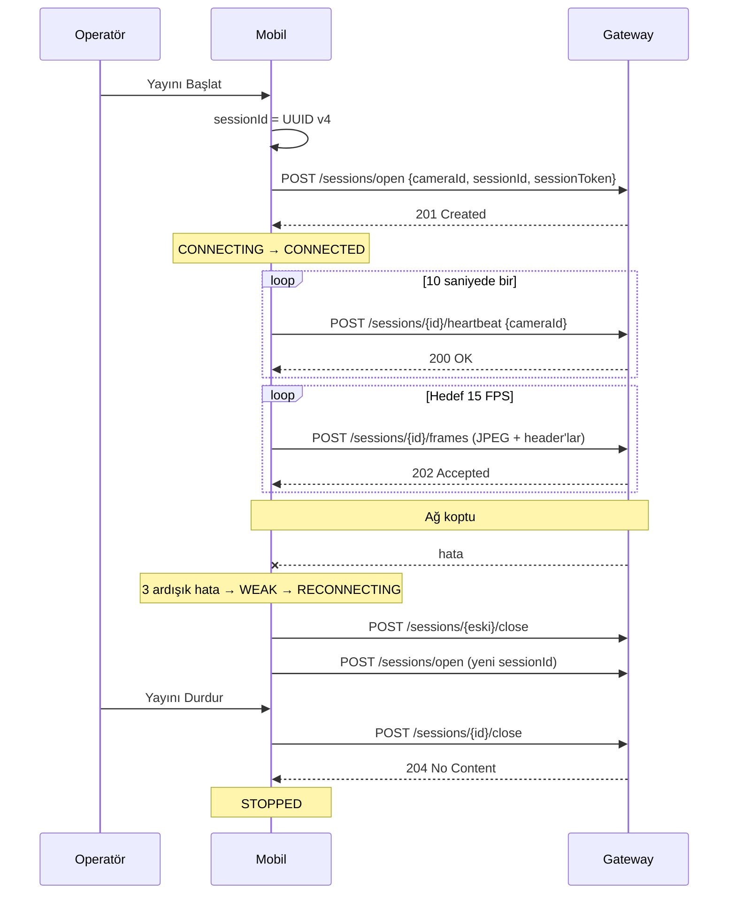

# Mobil Kamera İstemcisi (MOB-1 | Flutter & Gateway)

Telefonu fabrika kamerası gibi davrandıran Flutter uygulaması. Kamerayı açar,
yerel ön izleme gösterir, Camera Ingestion Gateway'de oturum açar ve JPEG
kareleri Gateway'e gönderir.

Görüntü **yalnızca Gateway'e** gider. Uygulama ring buffer tutmaz, AI için
örnekleme yapmaz, klip kaydetmez ve MinIO'ya bir şey yüklemez; bunlar Gateway
ve AI ekiplerinin sorumluluğundadır.

---

## Kurulum

```bash
cd mobile
flutter pub get
```

Gerçek cihazda Gateway'e erişmek için port yönlendirmesi gerekir:

```bash
adb reverse tcp:8000 tcp:8000   # Gateway
adb reverse tcp:8080 tcp:8080   # Backend 2 (kamera listesi için)
```

Çalıştırma:

```bash
flutter run \
  --dart-define=GATEWAY_URL=http://localhost:8000 \
  --dart-define=BACKEND_URL=http://localhost:8080
```

Emülatörde host makine `10.0.2.2` üzerinden görünür; bu iki değer varsayılan
olarak `10.0.2.2` kullanır, yani emülatörde `--dart-define` vermeden çalışır.

---

## Yapılandırma

Hiçbir endpoint, kimlik veya kodlama parametresi koda gömülü değildir. Hepsi
`lib/core/config/app_config.dart` üzerinden `--dart-define` ile verilir.

| Değişken | Varsayılan | Açıklama |
|----------|-----------|----------|
| `GATEWAY_URL` | `http://10.0.2.2:8000` | Camera Ingestion Gateway adresi |
| `BACKEND_URL` | `http://10.0.2.2:8080` | Spring Boot backend (kamera listesi) |
| `CAMERA_ID` | *(boş)* | Provizyonlanan kamera UUID'si |
| `CAMERA_KEY` | `dev-session-token` | Gateway `sessionToken` değeri |
| `TARGET_FPS` | `15` | Hedef gönderim hızı |
| `ENCODE_WIDTH` | `640` | Karelerin indirgeneceği genişlik |
| `JPEG_QUALITY` | `70` | JPEG kalitesi |
| `MAX_CONCURRENT_UPLOADS` | `8` | Aynı anda havada olabilecek kare sayısı |
| `FRAME_DIAGNOSTICS` | `false` | Kare başına encode/upload süresi loglar |

`FRAME_DIAGNOSTICS` saniyede 15 satır ürettiği için yalnızca ölçüm alırken
açılmalıdır.

---

## Kamera kimliği

`cameras.id` ve `camera_sessions.id` veritabanında `uuid` tipinde ve
`camera_sessions.camera_id` kayıtlı bir kameraya foreign key ile bağlı. Bu
yüzden **mobil rastgele cameraId üretmez**. Kimlik şu sırayla çözülür:

1. Kullanıcının uygulama içinden Backend 2 listesinden seçtiği kamera (kalıcı)
2. `--dart-define=CAMERA_ID` ile provizyonlanan UUID
3. Cihazda üretilip saklanan geliştirme UUID'si

Üçüncü seçenek yalnızca yerel geliştirme içindir; backend'de böyle bir kamera
kaydı olmadığından gerçek pipeline'da foreign key hatası verir.

`sessionId` her yayın başlangıcında yeni bir UUID v4'tür.

---

## Gateway sözleşmesi

Tüm gövde alanları camelCase'dir. Örneklerdeki token temsilidir.

### Oturum açma

```http
POST /api/v1/sessions/open
Content-Type: application/json

{
  "cameraId": "33333333-0000-4000-8000-000000000001",
  "sessionId": "9f1c4d2e-7b3a-4f52-9c11-2d8e6a0b4f31",
  "sessionToken": "***"
}
```

`201` yeni oturum, `200` aynı kimliklerle reconnect.

### Heartbeat (10 saniyede bir)

```http
POST /api/v1/sessions/{sessionId}/heartbeat
Content-Type: application/json

{ "cameraId": "33333333-0000-4000-8000-000000000001" }
```

### Kare gönderme

```http
POST /api/v1/sessions/{sessionId}/frames
Content-Type: image/jpeg
X-Camera-Id: 33333333-0000-4000-8000-000000000001
X-Frame-Timestamp: 2026-08-21T10:15:30.123Z

<ham JPEG byte'ları>
```

Zaman damgası UTC ve ISO-8601'dir; Gateway timezone taşımayan damgayı `422` ile
reddeder. Başarılı yanıt `202`.

### Oturum kapatma

```http
POST /api/v1/sessions/{sessionId}/close
Content-Type: application/json

{ "cameraId": "33333333-0000-4000-8000-000000000001" }
```

Yanıt `204` ve idempotenttir; kapalı oturum tekrar kapatılabilir.

---

## Bağlantı akışı



---

## Bağlantı durumları

| Durum | Ne zaman |
|-------|----------|
| `CONNECTING` | Oturum açılıyor |
| `CONNECTED` | Kareler kabul ediliyor |
| `WEAK` | Arka arkaya kare hatası başladı |
| `RECONNECTING` | Backoff ile yeniden bağlanılıyor |
| `OFFLINE` | Deneme sınırı doldu veya kullanıcı aksiyonu gerekiyor |
| `STOPPED` | Kullanıcı durdurdu ya da uygulama arka planda |

Durum tek bir kaynakta (`StreamingController`) tutulur; widget'lar kendi
bağlantı boolean'larını tutmaz.

---

## Yeniden bağlanma ve sessionId kuralı

- **Kullanıcı durdurup başlatırsa** yeni `sessionId` üretilir.
- **Otomatik reconnect'te de** yeni `sessionId` üretilir: mobil önce eski
  oturumu `close` eder, sonra yenisini açar. Gateway `open` çağrısını aynı
  `cameraId` + `sessionId` çifti için idempotent kabul ettiğinden eski kimliği
  korumak da mümkündür, ancak eski oturum kapatıldığı için tercih edilmez.
- **Manuel stop sonrası otomatik reconnect yapılmaz.** Kullanıcı kararı
  durumda ayrı tutulur.
- Yeniden denemenin çözmeyeceği hatalarda (geçersiz token, pasif kamera,
  oturum çakışması, kare çok büyük) hiç beklenmeden durulur ve kullanıcıya
  nedeni gösterilir.

### Deneme sınırı

Sınırlı exponential backoff: **1s, 2s, 4s**, en fazla **3 deneme**. Sonrasında
durum `OFFLINE` olur ve yeniden deneme kullanıcıya bırakılır. Ekran kapanınca
timer'lar iptal edilir; arka planda sonsuz retry olmaz.

---

## Backpressure ve kare düşürme

Gerçek zamanlı akışta eski kare değerini yitirir, bu yüzden hiçbir kare
sınırsız kuyruklanmaz:

- Aynı anda en fazla `MAX_CONCURRENT_UPLOADS` (varsayılan 8) yükleme yapılır;
  sınır aşılırsa yeni kare düşürülür.
- Hedef FPS aralığından önce gelen kareler düşürülür.
- Yayın durdurulduğunda veya yeniden bağlanıldığında havadaki kareler
  geçersizlenir ve gönderilmez.

Kareler yakalanma sırasına göre gönderilir; Gateway zaman damgası geriye giden
kareyi elediği için sıra korunmak zorundadır.

---

## Hata kodu eşlemesi

| Gateway | Kullanıcıya | Tekrar denenir mi |
|---------|-------------|-------------------|
| 401 `INVALID_SESSION_TOKEN` | Oturum anahtarı geçersiz veya süresi dolmuş | Hayır |
| 403 `CAMERA_INACTIVE` | Kamera pasif, yöneticiden etkinleştirilmeli | Hayır |
| 404 `SESSION_NOT_FOUND` | Oturum bulunamadı, yeniden başlatılıyor | Evet |
| 409 `SESSION_CONFLICT` | Bu kamerada başka aktif oturum var | Hayır |
| 413 `FRAME_TOO_LARGE` | Kare boyut sınırını aşıyor | Hayır |
| 415 / 422 | Kare biçimi veya bilgileri geçersiz | Hayır |
| 503 | Gateway backend'e ulaşamadı | Evet |
| Ağ hatası | Gateway'e ulaşılamıyor | Evet |

Kullanıcıya stack trace veya hata kodu gösterilmez.

---

## Demo akışı

1. Uygulamayı açın; kamera izni sorulur.
   - Reddederseniz açıklama ve **Tekrar Dene** görünür.
   - Kalıcı reddettiyseniz **Ayarları Aç** butonu uygulama ayarlarına götürür.
2. Sağ üstteki kamera ikonundan **backend kamerası** seçin (Backend 2 girişi
   ister). Seçim kalıcıdır.
3. Ön/arka kamera arasında geçiş yapın (yayın sırasında kilitlidir).
4. **Yayını Başlat**. Sol üstte bağlantı rozeti, sağ üstte FPS ve sayaçlar
   görünür.
5. Wi-Fi'ı kapatın: durum `WEAK` → `RECONNECTING` → `OFFLINE` ilerler.
6. Wi-Fi'ı açın ve yeniden başlatın.
7. Uygulamayı arka plana alın: yayın ve kamera kontrollü şekilde durur.
8. **Yayını Durdur**. Gateway'de oturum kapanır, kare gönderimi anında biter.

Doğrulama için Gateway metriklerine bakılabilir:

```bash
curl http://localhost:8000/metrics
```

`ingest_fps` mobildeki "Gönderim FPS" değeriyle örtüşmelidir.

---

## Proje yapısı

```
lib/
  main.dart                     Bootstrap ve ProviderScope
  app.dart                      MaterialApp
  core/
    config/app_config.dart      dart-define yapılandırması
    device/camera_identity.dart Kalıcı kamera kimliği, sessionId üretimi
    error/gateway_failure.dart  Hata kodu → kullanıcı mesajı eşlemesi
    network/api_client.dart     Gateway HTTP istemcisi (keep-alive)
    network/backend_client.dart Backend 2 istemcisi (login, kamera listesi)
  features/
    camera/                     İzin servisi ve ekran
    session/                    Oturum yaşam döngüsü, kamera seçimi
    streaming/                  Kare çıkarma, encode, upload, durum makinesi
  shared/widgets/               Bağlantı rozeti, hata bannerı, sayaç overlay'i
```

JPEG kodlama Android'de native `YuvImage.compressToJpeg`'e devredilir
(`android/.../MainActivity.kt`). Saf Dart kodlama gerçek cihazda kare başına
~2 saniye sürüyordu ve 15 FPS'i karşılamıyordu.

---

## Testler

```bash
flutter test
flutter analyze
```

Kapsam: Gateway hata kodu eşlemesi, oturum servisi sözleşmesi (camelCase gövde,
durum kodları, ağ hatası), frame metadata header'ları, Backend 2 istemcisi,
aktarım sayaçları, bağlantı durum modeli ve overlay widget'ları.

---

## Oturum token'ı hakkında (MVP kararı)

Gateway oturum token'ı **MVP boyunca sabittir** ve Backend 2'ye bağlanmaz.
Gateway `dev-session-token` değerini doğrular; mobil tarafta bu değer
`--dart-define=CAMERA_KEY` ile verilir, koda gömülü değildir.

Backend yalnızca kamera listesi için kullanılır. `camera_key_hash` sütunu
veritabanı şemasında ileriye dönük olarak duruyor, MVP'de kullanılmıyor.

MVP sonrasında kısa ömürlü token'a geçilirse tek yapılacak, `AppConfig.cameraKey`
okumasını `BackendClient` üzerinden gelen token ile değiştirmektir; oturum akışı
aynı kalır.
